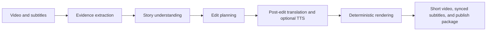

# VideoHub

**Current Version: v0.3.0**

English | [简体中文](./README.md)

VideoHub is a desktop video workflow application built with **PyQt6**. It combines **multi-platform media processing**, **speech transcription**, **bilingual subtitle generation**, **AI dubbing**, **LLM summaries**, **idle-time queue scheduling**, **browser extension integration**, and project-level skills for coding agents such as Codex, Claude Code, and DeepSeek.

It is designed for users who want to turn online or local media into reusable assets: local video/audio files, transcripts, subtitles, and structured markdown summaries.

## What's New: Story Editing and Film Commentary Skills

VideoHub now includes two project-level workflows for AI coding agents. Instead of cutting a video at fixed intervals, the agent first reads source-language subtitles and visual evidence, builds an evidence-backed understanding of the people, topics, events, and causal structure, then produces a validated edit plan. Deterministic Python and FFmpeg scripts handle the final edit, translation, dubbing, subtitles, and publishing assets.



| Skill | Main use | Deliverables |
| --- | --- | --- |
| `videohub-story-editor` | Turn long videos, podcasts, interviews, courses, or knowledge content into a coherent short-form story | Source-audio version with original or bilingual subtitles; MiniMax or Doubao TTS commentary with source audio around 30%; Douyin package with a 50-100 Chinese-character caption |
| `videohub-film-commentary` | Produce third-person commentary for films, TV episodes, and short dramas | Mixed narration and selected source-audio anchors; synced subtitles; 1080x1920 Douyin cover, title candidates, caption, hashtags, and a complete publish package |

Both workflows follow an “understand and edit first, translate afterward” rule. For foreign-language media, machine translation made before editing is not used as the sole basis for plot decisions. Subtitles are rebuilt against the final timeline and can optionally receive light DeepSeek polishing. Film commentary can preserve decisive lines, reveals, confessions, reactions, jokes, and farewells so narration does not erase the original performance.

> These workflows are currently exposed through `.agents/skills/` to coding agents that support project-level skills. They orchestrate the repository's Python and FFmpeg tools; they are not one-click editing buttons in the desktop GUI. Only process media you are authorized to download, edit, and publish.

### Planned: Visual Timeline for Film Commentary

Story editing and film commentary already produce validated `story_plan.json` and `narration_plan.json` files, subtitles, segmented TTS caches, and reusable clean masters, but the current release does not include a built-in web timeline editor. A future commentary workbench is planned to visualize video clips, source audio, TTS narration, source-audio anchors, and subtitle tracks. It will allow manual trim-point adjustments while reusing unchanged clip and TTS caches. The workbench is intended as a human refinement layer after the AI-assisted rough cut; final media will continue to use deterministic local FFmpeg rendering. This interface is not available in the current version.

## Feature Overview

| Feature | Description |
| --- | --- |
| Multi-platform media processing | Import and process content from YouTube, Twitter/X, Douyin, Bilibili, and more. |
| Audio / video workflows | Save full video or audio-only output depending on the task. |
| Whisper transcription | Transcribe local or online media using OpenAI Whisper. |
| Bilingual subtitles | Generate `.srt`, `.vtt`, and `.ass` subtitles, with optional translation. |
| Subtitle burn-in | Embed subtitles into video files when the workflow requires it. |
| AI dubbing | Generate Chinese voice-over for videos using speech synthesis technology. |
| Story editing | Understand long-form media from source subtitles and visual evidence, then select, reorder, translate, subtitle, and render a coherent short video. |
| Film commentary | Combine third-person TTS narration with selected original dialogue and generate Douyin publishing assets. |
| LLM summaries | Generate markdown summaries/articles from transcripts with customizable templates. |
| Batch processing | Process multiple URLs or local files in one run. |
| Idle queue scheduling | Queue tasks during the day and let VideoHub execute them in a configured idle window. |
| Browser extension | Add supported video pages directly to the local queue from Chrome/Edge. |
| Live recording | Includes a live recording integration layer for monitored stream capture. |
| FFmpeg management | Built-in FFmpeg configuration and testing helpers. |
| Claude Code skills | AI-assisted development workflows integrated through Claude Code CLI. |

## Disclaimer

This project is intended for lawful and authorized use only. Please read [DISCLAIMER.md](./DISCLAIMER.md) before using features related to third-party platform content, cookies, tokens, downloading, or recording.

## Current Limitations

- Live recording availability still depends on runtime imports, FFmpeg availability, and the target platform parser.
- Douyin user-profile download has an entry point, but usually requires a valid Cookie and optional dependencies; verify with a real run before relying on it.
- Some live platform detection branches in `src/live_recorder_adapter.py` are incomplete.
- Parts of the application are still centered around a large single-file GUI controller in `main.py`.

## Quick Start

### 1. Requirements

- Python 3.8+
- Windows is the primary tested platform
- FFmpeg for subtitle/video processing and live recording
- Optional: Chrome/Edge for the browser extension
- Optional: CUDA-capable GPU for faster Whisper transcription

### 2. Clone and install

```bash
git clone git@github.com:cacity/VideoHub.git
cd VideoHub

# Optional but recommended
conda create -n VideoHub python=3.12
conda activate VideoHub

pip install -r requirements.txt
```

### 3. Start the desktop app

```bash
python main.py
```

This launches the PyQt desktop GUI and also starts the local Flask API server on port `8765` for queue integration.

### 4. Optional command-line entry points

```bash
python src/youtube_transcriber.py --help
python src/douyin_cli.py "https://v.douyin.com/xxxxx/"
python src/ffmpeg_config_cli.py help
```

## Minimal Working Configuration

Create a `.env` file in the project root if you want summary generation or custom API endpoints.

```env
OPENAI_API_KEY=your_openai_key
OPENAI_BASE_URL=
OPENAI_MODEL=
DEEPSEEK_API_KEY=
```

You can also configure many options from the GUI settings page instead of editing `.env` manually.

## Usage

### Desktop GUI

Run the main application:

```bash
python main.py
```

Main tabs in the GUI include:

- **Online Video**
- **Local Audio / Video**
- **Batch Processing**
- **Idle Queue**
- **Live Recorder**
- **Processing History**
- **Settings**

### Media processing CLI

`src/youtube_transcriber.py` is the main reusable CLI for transcription, subtitles, summaries, template management, batch jobs, and cleanup.

#### Common examples

```bash
# Process a single YouTube video
python src/youtube_transcriber.py --youtube "https://www.youtube.com/watch?v=VIDEO_ID"

# Process video and generate subtitles
python src/youtube_transcriber.py --youtube "https://www.youtube.com/watch?v=VIDEO_ID" --download-video --generate-subtitles

# Burn subtitles into the processed/local video
python src/youtube_transcriber.py --youtube "https://www.youtube.com/watch?v=VIDEO_ID" --download-video --generate-subtitles --embed-subtitles

# Process a local audio file
python src/youtube_transcriber.py --audio "path/to/file.mp3"

# Process a local video file
python src/youtube_transcriber.py --video "path/to/file.mp4" --generate-subtitles

# Generate a summary directly from text
python src/youtube_transcriber.py --text "path/to/file.txt"

# Process multiple URLs
python src/youtube_transcriber.py --urls "<url1>" "<url2>"

# Preview cleanup
python src/youtube_transcriber.py --cleanup-preview
```

#### Key arguments

| Argument | Description |
| --- | --- |
| `--youtube` | Process a single YouTube URL |
| `--audio` | Process a local audio file |
| `--video` | Process a local video file |
| `--text` | Generate a summary from a local text file |
| `--batch` | Read URLs from a text file |
| `--urls` | Process multiple URLs from the command line |
| `--download-video` | Preserve the full video output instead of audio-only |
| `--generate-subtitles` | Generate subtitle files |
| `--no-translate` | Skip subtitle translation |
| `--embed-subtitles` | Burn subtitles into the video |
| `--transcribe-only` | Skip summary generation |
| `--template` | Use a named or explicit template file |
| `--history` | Show download/processing history |
| `--cleanup` | Clean generated output directories |

## Douyin Workflow

For Douyin single-link processing, use the dedicated CLI:

```bash
python src/douyin_cli.py "https://v.douyin.com/xxxxx/"
python src/douyin_cli.py "https://www.douyin.com/video/xxxxx" -o "workspace/douyin_downloads"
```

Notes:

- It is designed for **single-video processing workflows**.
- It expects the required Douyin backend/service to be available.
- User-profile batch download is not implemented in the current backend.

## AI Dubbing

VideoHub supports AI-powered Chinese voice dubbing for videos. This feature transforms your original video content into Chinese-narrated versions automatically.

### How it works

1. **Transcribe**: Extract speech from the video using Whisper
2. **Synthesize**: Generate Chinese audio using speech synthesis technology
3. **Sync**: Align the generated audio with the original video timeline
4. **Merge**: Combine the dubbed audio with the video file

### Output

- Dubbed video saved alongside the original
- Temporary audio files stored in `workspace/dubbing_temp/` (auto-cleaned after merge)
- Output naming convention: `{original_filename}_中文配音.mp4`

### Technical details

- Uses pip installable TTS engine for Chinese speech synthesis
- Supports subtitle-driven synthesis mode for precise timing
- Audio normalization and silence padding for smooth transitions
- GPU acceleration supported when available

## Project-level AI Agent Skills

This repository includes project-level skills under `.agents/skills/`. They are intended for Codex, Claude Code, and similar coding agents. They are not runtime dependencies for VideoHub; they document the current project entry points, routing rules, and implementation boundaries so agents can reuse existing GUI/CLI code instead of inventing parallel workflows.

### Available skills

| Skill | When to use it | Main entry point |
| --- | --- |
| `videohub` | Router for deciding which VideoHub skill applies | `main.py`, `src/youtube_transcriber.py` |
| `videohub-youtube` | YouTube, Twitter/X, Bilibili, local audio/video/text transcription, subtitles, translation, and summaries | `python src/youtube_transcriber.py --help` |
| `videohub-douyin` | Douyin single-video and user-profile download workflows | `python src/douyin_cli.py <url>` |
| `videohub-queue` | Idle queue, Chrome/Edge extension, and local API troubleshooting | `src/api_server.py`, `http://127.0.0.1:8765` |
| `videohub-ffmpeg` | FFmpeg status, path, mode, download, and test workflows | `python src/ffmpeg_config_cli.py help` |
| `videohub-subtitles` | Subtitle burn-in and standalone subtitle merge tool guidance | `embed_subtitles_to_video()`, `python src/subtitle_merger.py` |
| `videohub-story-editor` | Evidence-backed long-video understanding, selection, reordering, post-edit translation, source-audio/TTS versions, and Douyin packages | `.agents/skills/videohub-story-editor/scripts/` |
| `videohub-film-commentary` | Third-person film/TV commentary, selected source-audio anchors, synced subtitles, covers, titles, captions, and hashtags | `.agents/skills/videohub-film-commentary/scripts/` |
| `videohub-live` | Live recorder dependency, configuration, and runtime diagnostics | `src/live_recorder_adapter.py` |

### Using skills

Skills are automatically available to supported coding agents when working in this project. Use the router skill first for ambiguous requests, then the feature-specific skill for implementation or troubleshooting.

Example requests:

```text
Use videohub-story-editor to turn this 30-minute English interview into a
3-minute source-audio version. Translate after editing, burn bilingual subtitles,
and create a Douyin folder with a 50-100 Chinese-character caption.

Use videohub-film-commentary to make a 10-minute Chinese commentary version of
this TV episode. Use MiniMax TTS, lower source audio to 30% under narration,
preserve key original dialogue, and generate a vertical cover, titles, and caption.
```

Under the current project-folder convention, the agent creates an independent `workspace/projectNNN_<project_name>/` for each job and keeps source assets, evidence, story analysis, source maps, edit plans, subtitles, TTS caches, rendered media, publishing assets, and QA reports together. The lower-level scripts remain compatible with the default `workspace/review_packs/story_editor/`, `workspace/videos_with_subtitles/`, and `workspace/publish_packages/douyin/` locations. Story analysis and edit plans must pass schema validation before rendering; final media is checked for duration, subtitle boundaries, and complete decoding.

Current synchronization notes:

- Subtitle translation defaults to Google Translate and falls back to DeepSeek/OpenAI when Google fails.
- Subtitle target languages include `zh-CN`, `zh-TW`, `en`, `ja`, `ko`, `ru`, `fr`, `de`, `es`, `it`, `pt`, and `ar`; the default is `zh-CN`.
- Subtitle burn-in uses `embed_subtitles_to_video()` in `src/youtube_transcriber.py`; the standalone GUI tool is `src/subtitle_merger.py`.
- Douyin user-profile downloads have an entry point, but real availability depends on Cookie validity and optional dependencies.

## Browser Extension

The `chrome_extension/` folder contains the local browser extension.

Typical flow:

1. Load the unpacked extension in Chrome/Edge
2. Start `python main.py`
3. Open a supported video page
4. Click the injected button to add the task into the local idle queue

The extension communicates with the desktop app through the local API server.

## Idle Queue API

Once the GUI is running, the local API is available on `http://127.0.0.1:8765`.

### Available endpoints

- `GET /api/health`
- `GET /api/queue`
- `POST /api/queue/add`
- `DELETE /api/queue/clear`
- `DELETE /api/queue/remove/<task_id>`
- `GET /api/settings`
- `PUT /api/settings`

### Example calls

```bash
curl http://127.0.0.1:8765/api/health
curl http://127.0.0.1:8765/api/queue
curl -X POST http://127.0.0.1:8765/api/queue/add -H "Content-Type: application/json" -d '{"platform":"youtube","url":"https://example.com","title":"sample"}'
```

Required fields for queue insertion:

- `platform`
- `url`
- `title`

## FFmpeg Management

VideoHub ships with an FFmpeg management CLI:

```bash
python src/ffmpeg_config_cli.py status
python src/ffmpeg_config_cli.py test
python src/ffmpeg_config_cli.py mode auto
python src/ffmpeg_config_cli.py path "C:/ffmpeg/bin/ffmpeg.exe"
python src/ffmpeg_config_cli.py download
```

Use it to inspect current FFmpeg status, switch execution modes, set a custom binary path, or install/configure FFmpeg.

## Output Structure

Runtime-generated files are placed under `workspace/`.

```text
workspace/
  videos/
  downloads/
  subtitles/
  transcripts/
  summaries/
  videos_with_subtitles/
  native_subtitles/
  douyin_downloads/
  twitter_downloads/
  bilibili_downloads/
  live_downloads/
  review_packs/story_editor/  # evidence, analysis, edit plans, and QA reports
  videos_with_subtitles/      # rendered story and commentary videos
  publish_packages/douyin/    # video, cover, titles, caption, and hashtags
  dubbing_temp/          # AI dubbing temporary audio files
```

## Project Structure

```text
VideoHub/
├── main.py
├── src/
│   ├── youtube_transcriber.py
│   ├── douyin_cli.py
│   ├── ffmpeg_config_cli.py
│   ├── api_server.py
│   ├── live_recorder_adapter.py
│   └── subtitle_merger.py
├── chrome_extension/
├── .agents/skills/
│   ├── videohub-story-editor/
│   └── videohub-film-commentary/
├── workspace/
├── templates/
├── logs/
├── idle_queue.json
└── README.md
```

## Supported Platforms

| Platform | Download | Transcription | Subtitles | Notes |
| --- | --- | --- | --- | --- |
| YouTube | Yes | Yes | Yes | Native subtitle extraction available in some cases |
| Twitter / X | Yes | Yes | Yes | Login/cookies may help on restricted content |
| Douyin | Yes | Yes | Yes | Single-video workflow is the main supported path |
| Bilibili | Yes | Yes | Yes | Uses the shared media-processing pipeline |

## Typical Scenarios

### Scenario 1: Process a YouTube course playlist and generate subtitles

- Paste the playlist/video URL into the GUI
- Enable subtitle generation
- Optionally translate subtitles
- Save outputs under `workspace/`

### Scenario 2: Queue tasks during the day and process them at night

- Start `python main.py`
- Add items from the GUI or browser extension
- Let the idle queue run during the configured time window

### Scenario 3: Process a Douyin video link

- Copy the Douyin link or share text
- Extract the URL if needed
- Run `python src/douyin_cli.py "<douyin-url>"`

### Scenario 4: Turn a local lecture recording into a markdown summary

- Run `python src/youtube_transcriber.py --video "path/to/file.mp4"`
- Configure API keys if you want LLM summary generation
- Review transcript, subtitles, and summary in `workspace/`

### Scenario 5: Turn a long interview into a short bilingual story

- Ask a supported coding agent to use `videohub-story-editor`
- Review the evidence-backed story outline and source map before rendering
- Produce either a source-audio bilingual version or a TTS commentary version
- Review the final video, subtitles, QA report, and optional Douyin package

### Scenario 6: Produce film or TV commentary with selected original dialogue

- Ask the agent to use `videohub-film-commentary` and specify the target duration
- Let third-person narration compress setup, transitions, and repeated dialogue
- Preserve selected original lines and performances as non-overlapping audio anchors
- Generate the final commentary video plus a vertical cover, title candidates, caption, and hashtags

## Testing

There is no unified automated test suite documented in the repository yet. For smoke testing, use the existing entry points:

```bash
python src/youtube_transcriber.py --help
python src/douyin_cli.py --help
python src/ffmpeg_config_cli.py help
python main.py
```

## License

This project is licensed under the [MIT License](./LICENSE).

## Acknowledgements

- [PyQt6](https://www.riverbankcomputing.com/software/pyqt/)
- [yt-dlp](https://github.com/yt-dlp/yt-dlp)
- [OpenAI Whisper](https://github.com/openai/whisper)
- [Flask](https://flask.palletsprojects.com/)

## Star History

[](https://www.star-history.com/#cacity/VideoHub&Date)

If this project helps you, a star is welcome.
