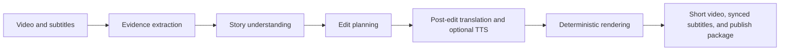

# VideoHub

**Current Version: v0.3.0**

English | [简体中文](./README.md)

VideoHub is a local video processing and intelligent editing workbench built with **PyQt6**, supporting **YouTube, Twitter/X, Douyin/TikTok, Instagram, Bilibili**, and local media. Alongside downloading, audio extraction, Whisper transcription, bilingual subtitles, subtitle translation, **AI dubbing**, and LLM summaries, its project-level skills for Codex, Claude Code, DeepSeek, and compatible agents provide evidence-grounded story editing, film commentary, configuration-driven batch episode editing, beat-synced edits, multi-format covers, and complete publishing packages. The desktop application also includes batch processing, an idle-time queue, and portable series-directory projects so multi-episode work can run in stages, reuse intermediate assets, and remain editable.

> **Need a working or customized workflow quickly?** Fixed-scope paid support starts at **USD 149**. Open a [public paid-support request](https://github.com/cacity/VideoHub/issues/new?template=paid-support.yml). No email is required; never post secrets, private media, customer data, or personal data.

## Paid setup and customization

### USD 59 self-serve workflow kit (pre-launch validation)

The **VideoHub Series Ops Kit** is being prepared as a one-time USD 59 Excel download with episode tracking, source-rights records, narration timing, subtitle QA, multi-ratio cover checks, final delivery gates, and a dashboard. Review the [actual workbook previews and planned delivery](./SERIES_OPS_KIT.md). It is not yet available for purchase. Use the [public, no-email interest form](https://github.com/cacity/VideoHub/issues/new?template=ops-kit-interest.yml) to share your use case and price fit. An interest issue is not an order, reservation, or payment obligation and does not guarantee a launch date, compatibility, sales, or revenue. Never post secrets, private media, customer data, or personal data.

The MIT-licensed open-source edition remains free. Fixed-scope implementation services are available if you prefer not to troubleshoot Python, FFmpeg, TTS, or repeatable series workflows yourself:

- **Async environment diagnosis — USD 149**: review of the secret-safe preflight report and sanitized error logs, a written root-cause assessment, prioritized next steps, and one public Issue follow-up; fully credited toward QuickStart booked within seven days.
- **QuickStart remote setup — USD 299**: installation, one authorized sample, a 45-minute handoff, and seven days of defect support.
- **Creator Series Workflow — USD 999**: consistent subtitles, aspect ratio, voice, covers, and three authorized samples.
- **Team Local Deployment — USD 2,999**: private deployment, one custom workflow, acceptance testing, training, and 30 days of defect support.

Services do not include bypassing platform restrictions, processing unlicensed content, third-party API costs, or unlimited maintenance. Read the [full scope, acceptance, and payment terms](./SERVICES.md), or open a [public paid support request](https://github.com/cacity/VideoHub/issues/new?template=paid-support.yml). Never post secrets, private media, or personal data in a public issue; requests and follow-ups are not handled by email at this time.

Review the evidence first: the [anonymized 11-episode authorized art-content case study](./CASE_STUDY.md) links the claim to repository-verifiable videos, subtitles, chapters, release notes, and 44 multi-format covers. Internal output counts are not presented as client counts or business results.

Before contacting us, run `python src/support_preflight.py` to generate a local environment report with no network calls or secret values, then use the [paid support request template](./SUPPORT_REQUEST.md) to supply the scope needed for tier and schedule qualification. If you only need the likely cause and remediation order, review the [sanitized USD 149 diagnosis delivery example](./docs/support_diagnosis_example.md).

## Install and Use with Codex or Claude Code

Repository: [https://github.com/cacity/VideoHub](https://github.com/cacity/VideoHub)

The simplest setup is to send the repository URL to a local Codex, Claude Code, or another agent that can read files and run commands, then ask it to clone, inspect, and configure the project:

```text
Install and configure this project: https://github.com/cacity/VideoHub
Place it in a dedicated project directory, check Python, FFmpeg, and requirements.txt,
install missing dependencies, and verify the desktop app and VideoHub skills under .agents/skills.
Explain any optional API-key configuration first; do not write credentials into source code or Git.
```

After setup, continue the task from the VideoHub project directory. Provide a video URL, local file, or series directory and describe the target duration, language, voice, subtitles, aspect ratio, and publishing platform. If the client does not automatically discover project skills, ask it to read `.agents/skills/videohub/SKILL.md` first.

```text
# YouTube story edit
Use VideoHub to process https://www.youtube.com/watch?v=VIDEO_ID. Read the source subtitles,
turn it into a coherent 5-minute source-audio edit, add bilingual subtitles, a title, caption, and cover.

# YouTube TTS commentary
Turn https://www.youtube.com/watch?v=VIDEO_ID into an 8-minute Chinese commentary video.
Use MiniMax at 1.2x, keep background source audio at 0.2, preserve decisive original dialogue,
and deliver a 1080p video plus the complete publish package.

# Douyin beat edit
Download and process https://v.douyin.com/xxxx/. Use its music to create a 30-second beat edit
from my media folder, burn no subtitles, and generate 3:4 and 4:3 covers plus publishing copy.

# Local film or episode batch
Use VideoHub to turn D:/videos/example.mp4 into a 10-minute film commentary video.
Or process every episode under D:/series/example/, making each episode 6 minutes with one shared
voice, cover style, and delivery specification, while supporting resume from completed stages.
```

Downloading, transcription, subtitles, and local editing do not require a paid LLM. Optional MiniMax or Doubao TTS and DeepSeek polishing require credentials supplied through environment variables or an untracked `.env`. Only process media you are authorized to download, edit, and publish.

## Intelligent Editing and Series Production

The newest workflows extend VideoHub from one-off edits to repeatable episodic production:

- **Configuration-driven episode batches**: `videohub-film-commentary` now has one shared series runner. TTS, audio levels, aspect ratio, cover settings, and paths live in `series_spec.json`; episode plots, narration blocks, source selections, and publishing copy live in `episode_specs.json`. New projects no longer copy a custom `build_episode_series.py` pipeline.
- **Staged execution and resume**: run `preflight`, `prepare`, `render`, `package`, `audit`, or `all`. Unchanged evidence, rendered segments, TTS block caches, and matching publish packages are reused. Preflight and planning do not call paid TTS APIs.
- **Series-directory mode**: batch processing can keep subtitles, translations, transcripts, and summaries beside the source episodes and write a portable `videohub_project.json`. Later skills only need the series directory to locate each video and its best subtitle file.
- **Five-track refinement**: the local timeline workbench manages clips, source audio, TTS narration, source-audio windows, and subtitles. The preview fits its available space, the preview/timeline split is resizable, and commentary subtitle placement can be adjusted manually.

Run a no-cost preflight before producing an episodic batch:

```powershell
python .agents/skills/videohub-film-commentary/scripts/run_series_commentary.py `
  "workspace/projectNNN_series" --episodes 1-12 --stage preflight
```

See [series-job-schema.md](./.agents/skills/videohub-film-commentary/references/series-job-schema.md)
for the configuration contract and full commands.

### Workflow and Main Skills

Instead of cutting a video at fixed intervals, the agent first reads source-language subtitles and visual evidence, builds an evidence-backed understanding of the people, topics, events, and causal structure, then produces a validated edit plan. Deterministic Python and FFmpeg scripts handle the final edit, translation, dubbing, subtitles, and publishing assets.



| Skill | Main use | Deliverables |
| --- | --- | --- |
| `videohub-story-editor` | Turn long videos, podcasts, interviews, courses, or knowledge content into a coherent short-form story | Source-audio version with original or bilingual subtitles; MiniMax or Doubao TTS commentary with source audio around 30%; Douyin package with a 50-100 Chinese-character caption |
| `videohub-film-commentary` | Produce third-person commentary for films, TV episodes, and short dramas | Mixed narration and selected source-audio anchors; synced subtitles; 1080x1920 Douyin cover, title candidates, caption, hashtags, and a complete publish package |
| `videohub-beat-editor` | Detect strong beats and select shots from long videos or media folders | Multi-aspect-ratio edits, optional lyric subtitles, covers, titles, captions, and hashtags |
| `videohub-cover-designer` | Build consistent covers for individual videos or episode series | 9:16, 3:4, 4:3, and 16:9 covers plus small-thumbnail readability previews |

These editing workflows follow an “understand and edit first, translate afterward” rule. For foreign-language media, machine translation made before editing is not used as the sole basis for plot decisions. Subtitles are rebuilt against the final timeline and can optionally receive light DeepSeek polishing. Film commentary can preserve decisive lines, reveals, confessions, reactions, jokes, and farewells so narration does not erase the original performance.

> These workflows are exposed through `.agents/skills/` to agents that support project-level skills. They orchestrate the repository's Python and FFmpeg tools; they are not one-click editing buttons in the desktop GUI.

### Visual Timeline Refinement

After the AI-assisted rough cut, an existing `workspace/projectNNN_*` commentary project can be refined in a local web workbench. It provides video preview and five tracks for video clips, source audio, TTS narration, source-audio anchors, and subtitles. Trim points and source-audio windows can be dragged; clips can be split, deleted, reordered, undone, and redone; subtitles can be adjusted. Every save creates a separate `revisions/rev-*` without overwriting source media or the original plan.

Unchanged video segments reuse the `.story_editor_cache/segments` cache, and an edited narration block can be regenerated independently with MiniMax. The same workbench also supports volume keyframes, per-clip fades, crossfades, multiple local video sources, and optional local DeepSeek rewriting. Final media is still rendered deterministically with local FFmpeg.

```powershell
cd frontend
npm install
npm run build

cd ..
python src/story_timeline_server.py
```

Open `http://127.0.0.1:8766/story-editor`. MiniMax block regeneration and DeepSeek rewriting require their respective local API keys; timeline editing, revision saving, and rendering remain available without them.

## Feature Overview

| Feature | Description |
| --- | --- |
| Multi-platform media processing | Import and process content from YouTube, Twitter/X, Douyin, Bilibili, and more. |
| Audio / video workflows | Save full video or audio-only output depending on the task. |
| Whisper transcription | Transcribe local or online media using OpenAI Whisper. |
| Bilingual subtitles | Generate `.srt`, `.vtt`, and `.ass` subtitles, with optional translation. |
| Subtitle burn-in | Embed subtitles into video files when the workflow requires it. |
| AI dubbing | Generate Chinese voice-over for videos using speech synthesis technology. |
| Story editing | Understand long-form media from source subtitles and visual evidence, then select, reorder, translate, subtitle, and render a coherent short video. |
| Film commentary | Combine third-person TTS narration with selected original dialogue and generate Douyin publishing assets. |
| Visual timeline refinement | Refine clips, narration, source-audio windows, subtitles, volume, fades, and crossfades in a five-track local workbench, then render a saved revision. |
| LLM summaries | Generate markdown summaries/articles from transcripts with customizable templates. |
| Batch processing | Process multiple URLs or local files in one run. |
| Idle queue scheduling | Queue tasks during the day and let VideoHub execute them in a configured idle window. |
| Browser extension | Add supported video pages directly to the local queue from Chrome/Edge. |
| Live recording | Includes a live recording integration layer for monitored stream capture. |
| FFmpeg management | Built-in FFmpeg configuration and testing helpers. |
| Claude Code skills | AI-assisted development workflows integrated through Claude Code CLI. |

## Disclaimer

This project is intended for lawful and authorized use only. Please read [DISCLAIMER.md](./DISCLAIMER.md) before using features related to third-party platform content, cookies, tokens, downloading, or recording.

## Current Limitations

- Live recording availability still depends on runtime imports, FFmpeg availability, and the target platform parser.
- Douyin user-profile download has an entry point, but usually requires a valid Cookie and optional dependencies; verify with a real run before relying on it.
- Some live platform detection branches in `src/live_recorder_adapter.py` are incomplete.
- Parts of the application are still centered around a large single-file GUI controller in `main.py`.

## Quick Start

### 1. Requirements

- Python 3.8+
- Windows is the primary tested platform
- FFmpeg for subtitle/video processing and live recording
- Optional: Chrome/Edge for the browser extension
- Optional: CUDA-capable GPU for faster Whisper transcription

### 2. Clone and install

```bash
git clone git@github.com:cacity/VideoHub.git
cd VideoHub

# Optional but recommended
conda create -n VideoHub python=3.12
conda activate VideoHub

pip install -r requirements.txt
```

### 3. Start the desktop app

```bash
python main.py
```

This launches the PyQt desktop GUI and also starts the local Flask API server on port `8765` for queue integration.

### 4. Optional command-line entry points

```bash
python src/youtube_transcriber.py --help
python src/douyin_cli.py "https://v.douyin.com/xxxxx/"
python src/ffmpeg_config_cli.py help
```

## Minimal Working Configuration

Create a `.env` file in the project root if you want summary generation or custom API endpoints.

```env
OPENAI_API_KEY=your_openai_key
OPENAI_BASE_URL=
OPENAI_MODEL=
DEEPSEEK_API_KEY=
```

You can also configure many options from the GUI settings page instead of editing `.env` manually.

## Usage

### Desktop GUI

Run the main application:

```bash
python main.py
```

Main tabs in the GUI include:

- **Online Video**
- **Local Audio / Video**
- **Batch Processing**
- **Idle Queue**
- **Live Recorder**
- **Processing History**
- **Settings**

### Media processing CLI

`src/youtube_transcriber.py` is the main reusable CLI for transcription, subtitles, summaries, template management, batch jobs, and cleanup.

#### Common examples

```bash
# Process a single YouTube video
python src/youtube_transcriber.py --youtube "https://www.youtube.com/watch?v=VIDEO_ID"

# Process video and generate subtitles
python src/youtube_transcriber.py --youtube "https://www.youtube.com/watch?v=VIDEO_ID" --download-video --generate-subtitles

# Burn subtitles into the processed/local video
python src/youtube_transcriber.py --youtube "https://www.youtube.com/watch?v=VIDEO_ID" --download-video --generate-subtitles --embed-subtitles

# Process a local audio file
python src/youtube_transcriber.py --audio "path/to/file.mp3"

# Process a local video file
python src/youtube_transcriber.py --video "path/to/file.mp4" --generate-subtitles

# Treat a directory of episodes as one portable series project
python src/youtube_transcriber.py --video "path/to/series" --generate-subtitles

# Generate a summary directly from text
python src/youtube_transcriber.py --text "path/to/file.txt"

# Process multiple URLs
python src/youtube_transcriber.py --urls "<url1>" "<url2>"

# Preview cleanup
python src/youtube_transcriber.py --cleanup-preview
```

#### Key arguments

| Argument | Description |
| --- | --- |
| `--youtube` | Process a single YouTube URL |
| `--audio` | Process a local audio file |
| `--video` | Process a local video file or a directory of episodes |
| `--series-project` | Store a single local video's outputs in its parent series directory |
| `--text` | Generate a summary from a local text file |
| `--batch` | Read URLs from a text file |
| `--urls` | Process multiple URLs from the command line |
| `--download-video` | Preserve the full video output instead of audio-only |
| `--generate-subtitles` | Generate subtitle files |
| `--no-translate` | Skip subtitle translation |
| `--embed-subtitles` | Burn subtitles into the video |
| `--transcribe-only` | Skip summary generation |
| `--template` | Use a named or explicit template file |
| `--history` | Show download/processing history |
| `--cleanup` | Clean generated output directories |

When a local directory is processed, VideoHub creates a portable series project. Source, translated,
and polished subtitles are stored under `subtitles/`; transcripts and summaries use their matching
subdirectories. The relative-path `videohub_project.json` manifest lets the story-editing and film-
commentary skills locate the right video and subtitle from the series directory alone.

## Douyin Workflow

For Douyin single-link processing, use the dedicated CLI:

```bash
python src/douyin_cli.py "https://v.douyin.com/xxxxx/"
python src/douyin_cli.py "https://www.douyin.com/video/xxxxx" -o "workspace/douyin_downloads"
```

Notes:

- It is designed for **single-video processing workflows**.
- It expects the required Douyin backend/service to be available.
- User-profile batch download is not implemented in the current backend.

## AI Dubbing

VideoHub supports AI-powered Chinese voice dubbing for videos. This feature transforms your original video content into Chinese-narrated versions automatically.

### How it works

1. **Transcribe**: Extract speech from the video using Whisper
2. **Synthesize**: Generate Chinese audio using speech synthesis technology
3. **Sync**: Align the generated audio with the original video timeline
4. **Merge**: Combine the dubbed audio with the video file

### Output

- Dubbed video saved alongside the original
- Temporary audio files stored in `workspace/dubbing_temp/` (auto-cleaned after merge)
- Output naming convention: `{original_filename}_中文配音.mp4`

### Technical details

- Uses pip installable TTS engine for Chinese speech synthesis
- Supports subtitle-driven synthesis mode for precise timing
- Audio normalization and silence padding for smooth transitions
- GPU acceleration supported when available

## Project-level AI Agent Skills

This repository includes project-level skills under `.agents/skills/`. They are intended for Codex, Claude Code, and similar coding agents. They are not runtime dependencies for VideoHub; they document the current project entry points, routing rules, and implementation boundaries so agents can reuse existing GUI/CLI code instead of inventing parallel workflows.

### Available skills

| Skill | When to use it | Main entry point |
| --- | --- |
| `videohub` | Router for deciding which VideoHub skill applies | `main.py`, `src/youtube_transcriber.py` |
| `videohub-youtube` | YouTube, Twitter/X, Bilibili, local audio/video/text transcription, subtitles, translation, and summaries | `python src/youtube_transcriber.py --help` |
| `videohub-douyin` | Douyin single-video and user-profile download workflows | `python src/douyin_cli.py <url>` |
| `videohub-queue` | Idle queue, Chrome/Edge extension, and local API troubleshooting | `src/api_server.py`, `http://127.0.0.1:8765` |
| `videohub-ffmpeg` | FFmpeg status, path, mode, download, and test workflows | `python src/ffmpeg_config_cli.py help` |
| `videohub-subtitles` | Subtitle burn-in and standalone subtitle merge tool guidance | `embed_subtitles_to_video()`, `python src/subtitle_merger.py` |
| `videohub-story-editor` | Evidence-backed long-video understanding, selection, reordering, post-edit translation, source-audio/TTS versions, and Douyin packages | `.agents/skills/videohub-story-editor/scripts/` |
| `videohub-film-commentary` | Third-person film/TV commentary, selected source-audio anchors, synced subtitles, covers, titles, captions, and hashtags | `.agents/skills/videohub-film-commentary/scripts/` |
| `videohub-beat-editor` | Strong-beat detection, shot selection, lyric subtitles, and multi-aspect-ratio beat edits | `.agents/skills/videohub-beat-editor/scripts/` |
| `videohub-cover-designer` | Consistent film, episode-series, and beat-video covers with thumbnail readability checks | `.agents/skills/videohub-cover-designer/scripts/` |
| `videohub-live` | Live recorder dependency, configuration, and runtime diagnostics | `src/live_recorder_adapter.py` |

### Using skills

See [Install and Use with Codex or Claude Code](#install-and-use-with-codex-or-claude-code)
for setup instructions and YouTube, Douyin, local-film, and episode-batch prompts. In supported agents, describe the source, target duration, version, subtitles, voice, aspect ratio, and publishing platform; use the router skill first when the workflow is ambiguous.

Under the current project-folder convention, the agent creates an independent `workspace/projectNNN_<project_name>/` for each job and keeps source assets, evidence, story analysis, source maps, edit plans, subtitles, TTS caches, rendered media, publishing assets, and QA reports together. The lower-level scripts remain compatible with the default `workspace/review_packs/story_editor/`, `workspace/videos_with_subtitles/`, and `workspace/publish_packages/douyin/` locations. Story analysis and edit plans must pass schema validation before rendering; final media is checked for duration, subtitle boundaries, and complete decoding.

Current synchronization notes:

- Subtitle translation defaults to Google Translate and falls back to DeepSeek/OpenAI when Google fails.
- Subtitle target languages include `zh-CN`, `zh-TW`, `en`, `ja`, `ko`, `ru`, `fr`, `de`, `es`, `it`, `pt`, and `ar`; the default is `zh-CN`.
- Subtitle burn-in uses `embed_subtitles_to_video()` in `src/youtube_transcriber.py`; the standalone GUI tool is `src/subtitle_merger.py`.
- Douyin user-profile downloads have an entry point, but real availability depends on Cookie validity and optional dependencies.

## Browser Extension

The `chrome_extension/` folder contains the local browser extension.

Typical flow:

1. Load the unpacked extension in Chrome/Edge
2. Start `python main.py`
3. Open a supported video page
4. Click the injected button to add the task into the local idle queue

The extension communicates with the desktop app through the local API server.

## Idle Queue API

Once the GUI is running, the local API is available on `http://127.0.0.1:8765`.

### Available endpoints

- `GET /api/health`
- `GET /api/queue`
- `POST /api/queue/add`
- `DELETE /api/queue/clear`
- `DELETE /api/queue/remove/<task_id>`
- `GET /api/settings`
- `PUT /api/settings`

### Example calls

```bash
curl http://127.0.0.1:8765/api/health
curl http://127.0.0.1:8765/api/queue
curl -X POST http://127.0.0.1:8765/api/queue/add -H "Content-Type: application/json" -d '{"platform":"youtube","url":"https://example.com","title":"sample"}'
```

Required fields for queue insertion:

- `platform`
- `url`
- `title`

## FFmpeg Management

VideoHub ships with an FFmpeg management CLI:

```bash
python src/ffmpeg_config_cli.py status
python src/ffmpeg_config_cli.py test
python src/ffmpeg_config_cli.py mode auto
python src/ffmpeg_config_cli.py path "C:/ffmpeg/bin/ffmpeg.exe"
python src/ffmpeg_config_cli.py download
```

Use it to inspect current FFmpeg status, switch execution modes, set a custom binary path, or install/configure FFmpeg.

## Output Structure

Runtime-generated files are placed under `workspace/`.

```text
workspace/
  videos/
  downloads/
  subtitles/
  transcripts/
  summaries/
  videos_with_subtitles/
  native_subtitles/
  douyin_downloads/
  twitter_downloads/
  bilibili_downloads/
  live_downloads/
  review_packs/story_editor/  # evidence, analysis, edit plans, and QA reports
  videos_with_subtitles/      # rendered story and commentary videos
  publish_packages/douyin/    # video, cover, titles, caption, and hashtags
  dubbing_temp/          # AI dubbing temporary audio files
```

## Project Structure

```text
VideoHub/
├── main.py
├── src/
│   ├── youtube_transcriber.py
│   ├── douyin_cli.py
│   ├── ffmpeg_config_cli.py
│   ├── api_server.py
│   ├── live_recorder_adapter.py
│   └── subtitle_merger.py
├── chrome_extension/
├── .agents/skills/
│   ├── videohub-story-editor/
│   └── videohub-film-commentary/
├── workspace/
├── templates/
├── logs/
├── idle_queue.json
└── README.md
```

## Supported Platforms

| Platform | Download | Transcription | Subtitles | Notes |
| --- | --- | --- | --- | --- |
| YouTube | Yes | Yes | Yes | Native subtitle extraction available in some cases |
| Twitter / X | Yes | Yes | Yes | Login/cookies may help on restricted content |
| Douyin | Yes | Yes | Yes | Single-video workflow is the main supported path |
| Bilibili | Yes | Yes | Yes | Uses the shared media-processing pipeline |

## X/Twitter Source Collection

VideoHub processes a direct public X/Twitter video URL through the normal media
workflow. If an agent helps collect links before they are added to VideoHub, keep
that agent as a source-discovery step only. For example, TweetClaw in OpenClaw
can search public tweets, replies, user posts, monitor results, and media
references, then hand VideoHub a reviewed packet with:

- canonical `https://x.com/<handle>/status/<id>` URL
- public text or approved excerpt
- author handle and capture time
- media notes and authorization caveats

Do not pass X cookies, browser profiles, session tokens, private messages, or API
keys into VideoHub prompts, queue files, or exported summaries. Use VideoHub's
download, transcription, subtitle, and summary workflow only after you verify
that you are allowed to process the content.

## Typical Scenarios

### Scenario 1: Process a YouTube course playlist and generate subtitles

- Paste the playlist/video URL into the GUI
- Enable subtitle generation
- Optionally translate subtitles
- Save outputs under `workspace/`

### Scenario 2: Queue tasks during the day and process them at night

- Start `python main.py`
- Add items from the GUI or browser extension
- Let the idle queue run during the configured time window

### Scenario 3: Process a Douyin video link

- Copy the Douyin link or share text
- Extract the URL if needed
- Run `python src/douyin_cli.py "<douyin-url>"`

### Scenario 4: Turn a local lecture recording into a markdown summary

- Run `python src/youtube_transcriber.py --video "path/to/file.mp4"`
- Configure API keys if you want LLM summary generation
- Review transcript, subtitles, and summary in `workspace/`

### Scenario 5: Turn a long interview into a short bilingual story

- Ask a supported coding agent to use `videohub-story-editor`
- Review the evidence-backed story outline and source map before rendering
- Produce either a source-audio bilingual version or a TTS commentary version
- Review the final video, subtitles, QA report, and optional Douyin package

### Scenario 6: Produce film or TV commentary with selected original dialogue

- Ask the agent to use `videohub-film-commentary` and specify the target duration
- Let third-person narration compress setup, transitions, and repeated dialogue
- Preserve selected original lines and performances as non-overlapping audio anchors
- Generate the final commentary video plus a vertical cover, title candidates, caption, and hashtags

## Testing

There is no unified automated test suite documented in the repository yet. For smoke testing, use the existing entry points:

```bash
python src/youtube_transcriber.py --help
python src/douyin_cli.py --help
python src/ffmpeg_config_cli.py help
python main.py
```

## License

This project is licensed under the [MIT License](./LICENSE).

## Acknowledgements

- [PyQt6](https://www.riverbankcomputing.com/software/pyqt/)
- [yt-dlp](https://github.com/yt-dlp/yt-dlp)
- [OpenAI Whisper](https://github.com/openai/whisper)
- [Flask](https://flask.palletsprojects.com/)

## Star History

[](https://www.star-history.com/#cacity/VideoHub&Date)

If this project helps you, a star is welcome.
