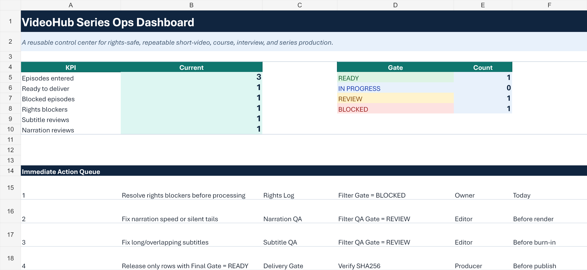
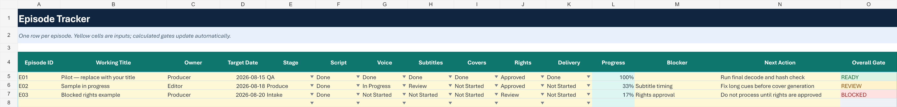
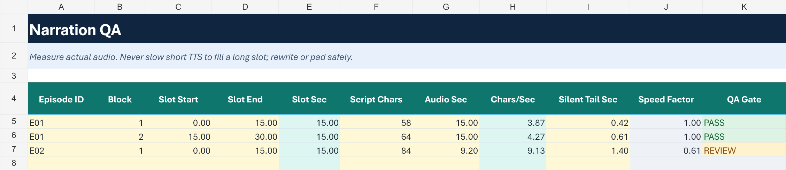
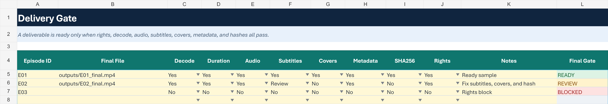

# VideoHub Series Ops Kit

The **VideoHub Series Ops Kit** is a planned one-time **USD 59** digital download for creators and small production teams that need one auditable place to coordinate repeatable video-series work.

It is currently in public demand validation and is **not yet available for purchase**. The open-source VideoHub repository remains free under its existing license.

## What the workbook covers

- Episode planning and owner/status tracking
- Source-rights records and blocking gates
- Narration timing and silent-tail QA
- Subtitle duration and overlap QA
- Multi-ratio cover readiness
- Final delivery checks, file hashes, and release gates
- A compact dashboard and immediate action queue

## Actual workbook previews

The images below are rendered from the finished v1.0 workbook with sample data. They are not design mockups and contain no customer data.

### Operational dashboard

### Episode tracker

### Narration QA

### Final delivery gate

## Delivery and compatibility

The planned download contains an `.xlsx` workbook plus start guide, license, changelog, and checksum manifest. It is designed for desktop Microsoft Excel. Compatibility with Google Sheets, LibreOffice, mobile spreadsheet apps, or every Excel version is not promised unless it is explicitly confirmed on the future checkout page.

The Kit does not include VideoHub installation, custom implementation, private-media review, platform-policy bypasses, source-media rights, third-party API usage, or a guarantee of views, sales, or revenue. Fixed-scope implementation services are described separately in [SERVICES.md](./SERVICES.md).

## Public, no-email interest validation

If the workflow matches your needs, submit the [Series Ops Kit interest form](https://github.com/cacity/VideoHub/issues/new?template=ops-kit-interest.yml). It asks about workflow, team size, pain points, Excel access, and whether USD 59 feels reasonable.

Submitting an interest issue is not an order, reservation, invoice, payment obligation, or promise that the product will launch. Do not post private media, customer data, credentials, API keys, or other sensitive information. Current interest validation and product questions stay on public GitHub; no email is collected or sent.
