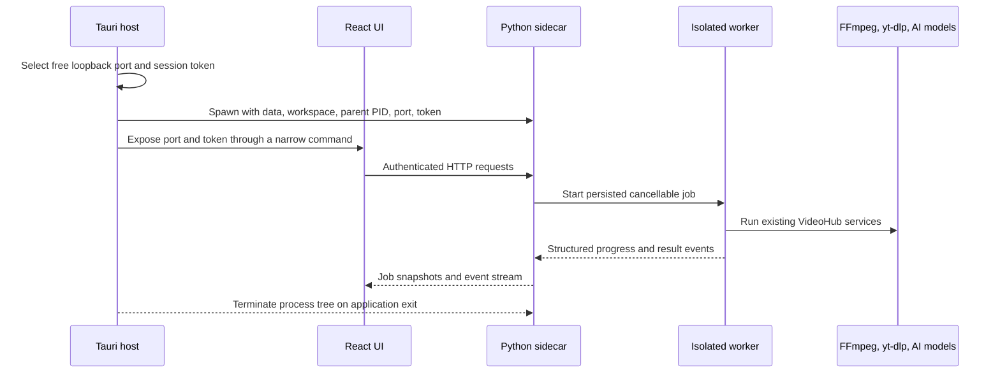

# VideoHub Tauri desktop migration

## Decision

VideoHub will migrate incrementally from a PyQt-only desktop application to a React/Tauri desktop host with a
Python sidecar. Existing Python media logic remains authoritative. Rust owns application lifecycle, local
process supervision, native dialogs, installation, and updates. React owns the user interface. The Python
sidecar owns jobs and media-domain behavior.

The PyQt entry point remains available until the Tauri application passes the feature-parity and clean-machine
release gates in this document.

## Process model

## Ownership boundaries

- `desktop/`: React/Vite UI and Tauri Rust host.
- `src/videohub_desktop/`: authenticated sidecar API, settings, job persistence, and operation adapters.
- `src/`: existing VideoHub media services. These modules must not import React or Tauri.
- `main.py` and `src/gui/`: legacy PyQt UI. No new domain behavior should be added here.
- `sidecar_entry.py`: source and packaged sidecar entry point.
- `scripts/build_desktop_*.ps1`: deterministic sidecar and installer builds.

## Runtime storage

The installed application must never write mutable files below `Program Files` or the bundle directory.

- Application settings and job state: `%LOCALAPPDATA%/VideoHub`.
- Default media workspace: `%LOCALAPPDATA%/VideoHub/workspace`, user-selectable in settings.
- External tools: bundled resources or an explicitly configured path.
- Local AI model weights: optional model packs under the data directory or a user-selected model directory.
- Secrets: operating-system credential storage in the release build. They must not be sent in job payloads,
  command-line arguments, logs, or Git files.

`src/paths_config.py` keeps repository-relative defaults for source development and supports environment
overrides for the installed sidecar.

## Job contract

All long-running desktop operations use the same states:

`queued -> running -> succeeded | failed | cancelled | interrupted`

Every job has an ID, operation name, sanitized parameters, timestamps, progress from 0 to 100, current message,
bounded logs, result, and an optional error. The sidecar persists request and status files atomically. A worker
process is used so cancellation can terminate FFmpeg, yt-dlp, Whisper, or TTS descendants without terminating
the desktop API.

## API surface

- `GET /v1/health`
- `GET /v1/capabilities`
- `GET /v1/paths`
- `GET/PUT /v1/settings`
- `GET/POST /v1/jobs`
- `GET /v1/jobs/{job_id}`
- `GET /v1/jobs/{job_id}/events`
- `POST /v1/jobs/{job_id}/cancel`
- compatibility routes for the browser extension idle queue
- story timeline routes migrated from `story_timeline_server.py`

Only `127.0.0.1` is used. Tauri creates a random token for each launch. All `/v1` routes except health require
`Authorization: Bearer <token>` when a session token is configured.

## Feature-parity matrix

| Area | Legacy source | Tauri target | Release gate |
| --- | --- | --- | --- |
| Multi-platform input | YouTube, Twitter/X, Bilibili, Instagram, Douyin, Koushare | Download workspace | Real fixture or mocked adapter tests |
| Local media | audio, video, text, directory, audio extraction | Local workspace | Chinese and space-containing paths |
| Transcription | Whisper | Job options and model manager | CPU smoke test and GPU fallback |
| Subtitles | native, generated, translate, polish, burn | Subtitle workspace | cue count, timestamp, and decode checks |
| Dubbing | Kokoro, MiniMax, Doubao, CosyVoice | Dubbing workspace | cached preview and one end-to-end sample |
| Batch/series | URL batch and portable series projects | Project workspace | resume and per-item failure behavior |
| Story editor | React timeline and Flask service | Native Tauri route | edit, save revision, render, cancel |
| Queue/extension | idle queue and local API | Compatibility API | extension request regression tests |
| History/cleanup | local JSON and workspace cleanup | History and storage pages | dry-run before deletion |
| Live recording | live recorder adapter | Live workspace | start, stop, restart, output validation |
| Settings | `.env` and JSON files | settings plus credential store | no secret returned to renderer |

## Delivery phases

1. Architecture baseline: branch, contracts, storage overrides, sidecar health, persisted jobs, tests.
2. Desktop vertical slice: Tauri starts the sidecar; React can create, watch, and cancel a preflight/download job.
3. Core migration: download, local processing, transcription, subtitles, translation, dubbing, batch, queue, settings.
4. Studio migration: story timeline, series projects, commentary, cover and publish-package workflows.
5. Remaining parity: history, cleanup, live recording, browser-extension compatibility, model management.
6. Distribution: PyInstaller sidecar, bundled external tools, NSIS/MSI, updater, signing, clean Windows VM audit.

## Completion gates

The migration is complete only when all of the following are proven from the current branch:

- The legacy Python test suite and new sidecar tests pass.
- TypeScript type checking and the production Vite build pass.
- `cargo fmt`, `cargo check`, and Clippy pass.
- Tauri starts and stops the sidecar without leaving child processes.
- Every feature-parity row has an executable UI path and verification evidence.
- NSIS and MSI artifacts install and run on a clean supported Windows machine without Python or Node installed.
- FFmpeg/ffprobe/yt-dlp discovery works after installation.
- Local model absence produces an actionable setup state rather than an application crash.
- Chinese, spaces, and long paths are covered.
- Cancellation, restart, interrupted-job recovery, uninstall, and user-data retention are verified.
- README, README_en, development log, release notes, and third-party notices match the shipped behavior.

## Rollback

`python main.py` remains the rollback path until the completion gates pass. The Tauri work stays on
`feature/tauri-desktop-migration` and is not merged into `main` before the user reviews the installer and the
feature-parity report.
