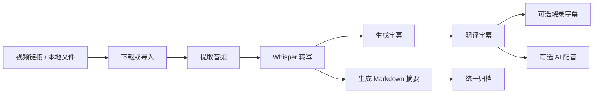
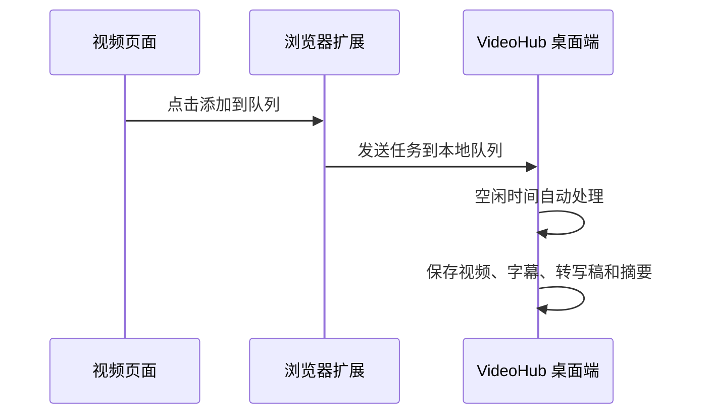
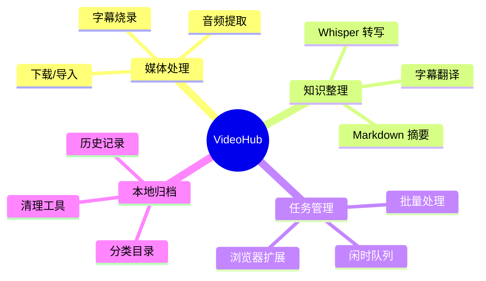

# VideoHub：把长视频变成字幕、笔记和知识库的本地工具

你有没有遇到过这种情况：收藏了很多课程视频、技术分享、访谈节目，真正要用的时候，却只能重新打开视频，一点点拖进度条找内容？

有些视频一个小时起步，里面可能只有几分钟是你真正需要的。英文视频还要看字幕、查单词、等翻译；技术课程想做笔记，又要在播放器、字幕工具、转写工具、翻译工具和 Markdown 编辑器之间来回切换。等一整套流程走完，真正学习和整理的精力反而被消耗掉了。

我做 VideoHub，最初就是想解决这个问题。

它不是一个单纯的视频下载器，也不是只做语音转文字的小工具。我更希望它成为一个本地视频知识整理工作台：把视频链接、本地视频、本地音频，统一变成可以搜索、可以阅读、可以归档、可以继续复用的知识资料。

VideoHub 是我最近整理和开源的一个本地视频知识整理工具，项目地址：

[https://github.com/cacity/VideoHub](https://github.com/cacity/VideoHub)

## 我想解决的不是下载，而是复用

很多人收藏视频，其实收藏的是里面的信息。但视频天然不适合快速检索。你很难像搜索一篇文章那样搜索视频内容，也很难在几个月后快速找到某个观点、某段讲解或某个例子。

所以 VideoHub 的核心目标很简单：

把视频变成可检索、可阅读、可复用的知识资料。

围绕这个目标，它把几个常见步骤串到了一起：获取视频或导入本地文件，提取音频，语音转写，生成字幕，翻译字幕，生成 Markdown 摘要，必要时再做字幕烧录或中文配音。最终得到的不只是一个视频文件，而是一组更方便使用的材料。

这个流程适合处理长视频、课程、会议录制、访谈、技术分享和讲座。它的价值不是让某一个步骤看起来很酷，而是减少重复操作，让内容整理这件事更顺手。

## 场景一：整理技术课程和讲座

技术课程和公开讲座通常信息密度高，但视频时长也长。看第一遍的时候容易觉得内容都懂了，过一段时间再找某个知识点，就会发现只能重新打开视频慢慢翻。

用 VideoHub 处理这类内容时，可以把 YouTube、Bilibili 或本地课程视频导入进来，生成转写稿、字幕文件和 Markdown 摘要。摘要可以按模板整理成学习笔记、课程提纲或文章草稿。这样后续复习时，不需要每次都重新看完整视频，可以先读摘要，再根据字幕或转写文本定位到具体片段。

对于播放列表或多个视频，也可以使用批量处理。比如一门课程有十几集，可以先把链接放进去，让工具按顺序处理，最后在本地目录里得到一组结构化材料。

## 场景二：处理英文视频

英文视频是另一个高频场景。很多技术内容、访谈和课程首先发布在 YouTube 上，但直接观看英文长视频并不总是轻松。VideoHub 在这里提供了几种处理方式。

如果视频本身有原生字幕，工具会优先尝试使用原生字幕，这样速度更快，也能避免重复转写。没有可用字幕时，再使用 Whisper 从音频中生成转写文本。生成字幕后，可以继续翻译成中文，也可以生成双语字幕文件。

对于想要离线观看或分享给不方便看外挂字幕的人，还可以把字幕烧录到视频里。对于需要中文讲解版本的场景，也可以基于字幕生成中文配音，再合成回视频。这个功能不是为了替代人工精细制作，而是给学习、预览和资料整理提供一个更省事的本地流程。

## 场景三：批量收藏，空闲时间处理

视频处理通常比较耗时间，尤其是下载、转写、翻译、合成这些步骤。如果每次都守着电脑等结果，体验并不好。

所以 VideoHub 做了闲时队列。白天看到有价值的视频，可以先加入队列；晚上或电脑空闲时，再让它自动依次处理。这个逻辑很适合处理长视频和批量任务。

项目还配了 Chrome/Edge 浏览器扩展。在 YouTube、Twitter/X、Bilibili、Koushare 等页面中，可以通过页面按钮把当前视频加入本地队列。桌面端启动后，会通过本地 API 接收这些任务，并在“闲时队列”里统一管理。

这个设计的目的很直接：看到好内容时先收集，不打断当下工作；真正耗时的处理，交给电脑空闲时完成。

## 场景四：本地资料也能进入同一套流程

VideoHub 不只处理在线视频。本地音频、本地视频、本地文本也可以进入同一套工作流。

比如你有一段会议录音，可以直接转写成文本，再生成会议纪要；有一段录屏课程，可以生成字幕和摘要；已经有一份文字稿，也可以跳过音视频步骤，直接生成结构化文章。这样不同来源的材料最终都能沉淀到同一套目录和格式里，方便后续查找。

这也是我比较看重的一点：工具不应该只服务于某个平台，而应该服务于“内容整理”这个目标。

## 技术实现上的几个特点

VideoHub 是一个 PyQt6 桌面应用，主界面把在线处理、本地音频、本地视频、本地文本、批量处理、闲时队列、字幕翻译、AI 配音、清理工具和设置等入口放在一起。核心媒体处理逻辑主要复用命令行模块，桌面端负责把这些能力组织成可操作的工作流。

底层能力大致由几部分组成：

- `yt-dlp` 负责多平台媒体获取。
- `FFmpeg` 负责音频提取、视频合成、字幕烧录等音视频处理。
- `Whisper` 负责语音转写。
- 翻译模块负责字幕翻译，支持常规翻译和大模型翻译路径。
- LLM 摘要模块负责把转写文本整理成 Markdown 文章。
- Flask 本地 API 负责连接浏览器扩展和桌面端闲时队列。

近期项目也整理了输出目录。所有运行时产物统一放到 `workspace/` 下，并按平台和用途区分，例如 YouTube、抖音、Twitter、Bilibili、字幕、转写稿、摘要、带字幕视频、配音输出等都有各自目录。这样做不是为了形式好看，而是为了避免文件越用越乱，后续清理和归档都更明确。

## 也说一下边界

VideoHub 目前仍然是一个持续完善中的个人项目，有些能力并不是“所有平台、所有链接、所有场景都能稳定处理”。

比如直播录制功能依赖额外的 `live_recorder/` 模块；如果本地没有对应模块，只能保留界面和适配逻辑。抖音单视频处理已经有独立流程，但抖音用户主页批量下载不是当前后端已经完成的能力。不同平台对 cookies、token、登录态、下载和访问限制也各有规则，实际使用时要遵守平台条款和版权边界，只处理自己有权处理的内容。

我更愿意把它定位成一个本地视频知识整理工具，而不是万能下载器。它的重点是把常见流程串起来，减少重复劳动，让长视频里的信息更容易沉淀下来。

## 项目地址

项目已经开源，感兴趣的朋友可以查看源码、体验功能，也欢迎 Star、Issue 和 PR。

[https://github.com/cacity/VideoHub](https://github.com/cacity/VideoHub)

如果你也经常处理课程、访谈、技术分享、会议录制或英文长视频，可以试试看。后续我也会继续围绕稳定性、平台适配、字幕质量、批量处理体验和目录管理继续完善。
